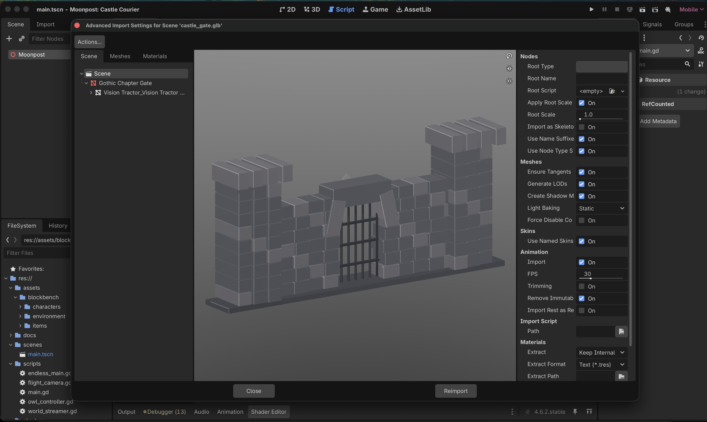

# Moonpost: Castle Courier

Атмосферная игра о сове-почтальоне, которая летит через бесконечный готический мир и доставляет письма хозяевам старинных замков.

## Об игре

Путешествие начинается на закате среди розово-оранжевого неба. Постепенно наступает ночь, загораются факелы, а впереди появляются леса, руины и мрачные замки.

С каждым пройденным участком сова летит быстрее. Камера отдаляется, окружение начинает слегка размываться, а полёт становится всё напряжённее. Добравшись до замка, сова передаёт письмо его хозяину и продолжает путь к следующей точке назначения.

Мир создаётся процедурно и может продолжаться бесконечно. Дороги, деревья, камни, руины, факелы и замки каждый раз собираются в новый маршрут.

Все модели сделаны в Blockbench и аккуратно распределены по группам внутри проекта: персонажи, окружение, архитектура, дороги и игровые предметы.
